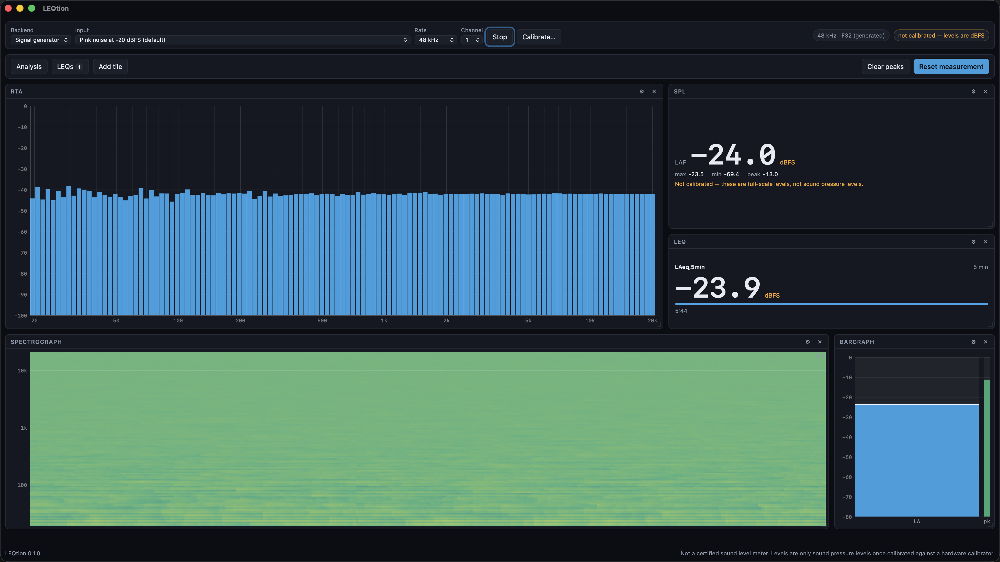

# LEQtion

> **AI-assisted project.** This codebase was created with [Claude Code](https://claude.com/claude-code)
> (Anthropic), directed and reviewed by a human author. The DSP is verified numerically:
> the A and C weighting curves reproduce the IEC 61672-1 table to better than 0.06 dB at
> the exact midband frequencies, the weighting *filters* are held to a measured deviation
> budget per sample rate, a full-scale sine reads 0 dBFS through the band integrator, and
> LEQ is checked against signals whose answer is known in advance. All of that is pinned
> as tests. The audio path has been run against real Core Audio hardware on macOS.
> It has **not** been checked against a reference sound level meter, no hardware
> calibrator has been connected to it, and the ASIO path compiles but has never carried
> audio. LEQtion is **not a certified sound level meter** and makes no conformance claim.

A desktop sound level meter and dual-channel analyser: RTA, spectrograph, bargraph,
time-weighted SPL, as many user-defined LEQs as you want, a signal generator, and
transfer function measurement with phase and coherence — arranged on a grid of tiles you
lay out yourself.



*Measuring its own signal generator — pink noise at −20 dBFS, taken through the `Signal
generator` backend with no hardware in the chain. Pink noise is flat per octave, so a
fractional-octave RTA reading flat across the band is the check: a wrong window, a wrong
normalisation or a wrong band integration would show as a tilt or a step instead. LAF and
LAeq,5min agree within 0.1 dB over a complete window, and every level says dBFS because
nothing here is calibrated.*

**Status: alpha.** The measurement core is well tested and the app runs; it has not yet
been used in anger on a show.

## What it does

- **RTA** — fractional-octave spectrum from 1/1 down to 1/48, with selectable transform
  size, window, overlap, averaging and peak hold.
- **Spectrograph** — the same bands over time, scrolling, on the same log axis as the RTA
  so the two line up when stacked.
- **Bargraph** — level meter with a held maximum, and a separate input-peak strip that
  stays in dBFS because headroom is an electrical question.
- **SPL** — time-weighted level with Fast, Slow and Impulse, plus max, min and peak.
- **LEQ** — define as many as you like. Each has its own **window** (any length you type,
  or a preset from 1 second to an hour, or "since reset") and its own **weighting**
  (A, C or Z). They run in the engine, so an LEQ keeps integrating whether or not a tile
  is showing it.
- **Calibration** — against a hardware acoustic calibrator, 94 or 114 dB at 1 kHz.
- **Tiles** — add, remove, drag and resize. The layout persists.
- **Generator** — pink noise, white noise, sine, and a repeating log sweep, out of a
  channel you choose, with optional band-limiting. Level is dBFS RMS and the expected
  *peak* is shown beside it, because pink noise at −6 dBFS RMS clips hard while reading
  like a conservative setting.
- **Transfer function** — magnitude, phase and coherence against a reference, which is
  either the generator's own output tapped internally or a hardware loopback on an input.
  Multi-time-window, so the bottom and top of the range are both usable.
- **Delay finding** — locates the arrival from the impulse response, sub-sample
  interpolated, and reports it in milliseconds, metres and samples with a confidence
  figure.
- **Signal generator as an input** — the same signals are also offered as a *backend*,
  feeding the analyser directly with no device in the chain. It is how you check the
  meter itself: pink noise reads flat on a fractional-octave display, so a wrong window,
  a wrong normalisation or a wrong band integration shows up as a tilt rather than as a
  plausible curve. It runs on a machine with no interface, no microphone and no
  microphone permission. Calibration is refused while it is open — there is no capsule
  in the chain, and an offset taken from a synthetic sine would be a number invented out
  of nothing.
- **Backends** — Core Audio, WASAPI, ALSA and JACK out of the box; ASIO behind a build
  flag ([docs/asio.md](docs/asio.md)).

## The bits that matter

### LEQ is filtered in the time domain, not weighted after an FFT

LEQ is an integral of weighted pressure squared over time. Deriving it by tilting an FFT
with a weighting curve makes the answer depend on the window, the overlap and the
transform length — none of which have anything to do with the sound. LEQtion filters the
samples through an IEC 61672 weighting filter and integrates those, so the answer depends
only on the signal.

A related trap the code guards against: **an LEQ is not an average of a Fast-weighted
level.** That answer is close, and wrong in a way that grows with how peaky the signal is.
Averaging is done on mean squares throughout; a mean of decibels is not a level, and
`leq.rs` has a test that fails if anyone "simplifies" it into one.

### The weighting filter, and what it actually achieves

The analogue A-weighting design has two more poles than zeros, and every s→z transform has
to do something with that surplus. Both textbook answers are badly wrong at the top of the
audio band:

| Design | A-weighting error at 19 kHz, 48 kHz sample rate |
|---|---|
| Bilinear — forces a double zero onto Nyquist | −13.6 dB |
| Plain matched-Z — invents no surplus zero at all | +7.2 dB |
| **What LEQtion does** | **under 1 dB** |

Sections carrying the numerator's zeros at the origin are bilinear, because bilinear maps
s=0 to z=1 and puts those zeros exactly where they belong. The pole-only sections are
matched-Z with a *single* shaping zero whose position is fitted, per sample rate, by a
golden-section search minimising the worst deviation from the analytic curve. It runs once
when a device opens.

Measured worst deviation over 20 Hz – 20 kHz:

| Sample rate | A | C |
|---|---|---|
| 44.1 kHz | 1.15 dB | 0.30 dB |
| 48 kHz | 0.99 dB | 0.21 dB |
| 96 kHz | 0.22 dB | 0.01 dB |

A minimax fit spreads its error rather than confining it to the top octave, so at 44.1 kHz
A-weighting is about 1.1 dB out by 10 kHz. That is the honest shape of it. What it costs in
practice is much less: on a deliberately harsh 29-tone signal with as much energy at 16 kHz
as at 1 kHz, the resulting A-weighted level is 0.23 dB out. **Run at 96 kHz if you care** —
it costs nothing but CPU and makes the weighting effectively exact, which is why the app
shows the sample rate rather than hiding it.

### The transfer function shows you where not to believe it

`H = Sxy/Sxx` — the H1 estimator, from **complex-averaged** cross-spectra. Three details,
and getting any of them wrong gives a plausible-looking curve that is wrong: the
cross-spectrum must be averaged as a complex number, coherence is only defined across
averages (a single frame always reads exactly 1), and the reference must be
delay-compensated before any of it means anything.

Coherence is drawn, not hidden. Every point is faded in proportion to it, and the
magnitude trace **breaks** wherever coherence falls below the floor. A transfer function
without coherence looks equally confident where the measurement is solid and where it is
picking up the air conditioning, and people tune systems off the second kind.

### One FFT length cannot serve 20 Hz and 16 kHz

At 48 kHz a 16384-point transform gives 2.9 Hz bins: about right at 30 Hz, absurdly narrow
at 10 kHz where it buys nothing and costs stability. A short transform is the reverse.

So several transforms run in parallel — each serving a couple of octaves, halving in length
as frequency rises — stitched onto one set of points at a fixed number per octave. Each
slice's length is chosen so its bin spacing is finer than the output point spacing at the
*bottom* of the range it serves, and a test asserts exactly that for every point.

### Uncalibrated levels are labelled dBFS, always

Until you calibrate, every level is a full-scale level and the app says so — on the SPL
tile, on the LEQ tile, and in the device bar. An uncalibrated number presented as a sound
pressure level is the single most damaging thing a meter can do.

### Calibration is refused when it should be

A calibration is trusted silently for the rest of a measurement, so the run has to satisfy
four things before it can be accepted: a steady level (spread under 0.5 dB), the right
frequency (the tone must be within 5% of what the calibrator claims), no clipping, and a
tone well clear of the noise floor. There is no override. Each refusal explains what to do
about it — "unstable" usually means the calibrator is not seated on the capsule, and saying
so is more useful than saying "unstable".

What it cannot check: that the calibrator is itself in calibration, or that the preamp gain
is not changed afterwards. Changing gain by one click invalidates the offset completely and
nothing in software can detect it, which is why the calibration records the device it was
taken on.

### Dropped audio is reported, loudly

If the analysis thread falls behind, the audio callback discards samples rather than
blocking the driver. Time then goes missing, and every LEQ on screen is short by an unknown
amount. The device bar says so and tells you to restart the measurement. A meter that
quietly stretches time is worse than one that admits a gap.

## Command-line tools

Two diagnostics ship with it, for when a measurement looks wrong and the GUI is in the way.

Check that an input delivers audio at all:

```bash
cargo run -p leqtion-audio --example capture -- --list
```

```bash
cargo run -p leqtion-audio --example capture -- --seconds 3
```

A run that reports frames arriving at exactly digital silence is the signature of macOS
denying microphone access.

The whole measurement chain without the window — same engine, same numbers:

```bash
cargo run --example meter -- --seconds 30 --offset 120
```

`capture --list` also shows output devices, which matters more than it looks: if your input
device has no output side of the same name, the generator falls back to the default output
and the two run on **separate clocks**. The internal reference then drifts and the delay has
to be found again every few minutes. The app says so when it happens. An interface whose
input and output are one device — any Dante card, any USB interface — has no such problem.

## Build and run

```bash
npm install
```

```bash
npm run app
```

```bash
npm run app:build
```

Tests:

```bash
npm test && (cd src-tauri && cargo test --workspace)
```

## What still needs real hardware

Everything is verified against synthetic signals; nothing has been checked against a
reference meter, a calibrator or a loudspeaker. [`docs/field-test.md`](docs/field-test.md)
is the checklist for doing that, in the order the steps depend on each other — an
electrical loopback before anything acoustic, and calibration before either.

## Licence

MIT.

---

All levels are computed, not certified. Calibrate against a hardware calibrator before
quoting a number, and verify against a reference meter before anyone relies on one.
